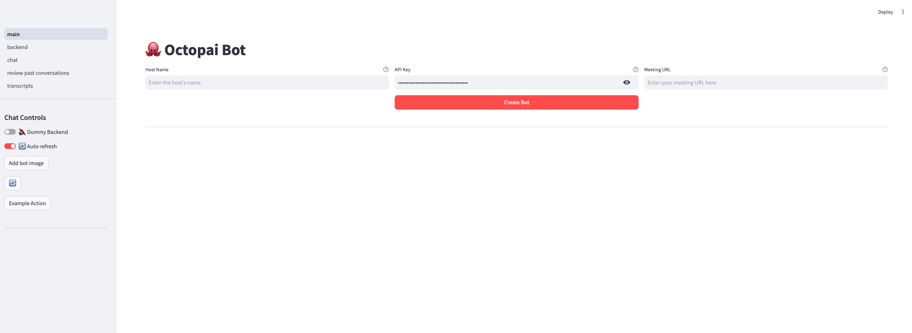
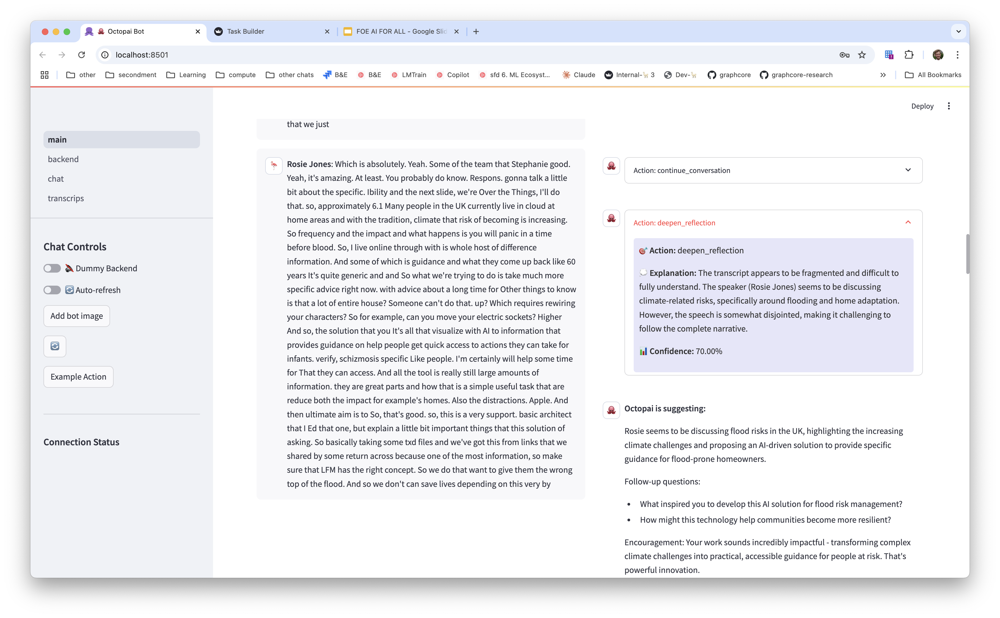
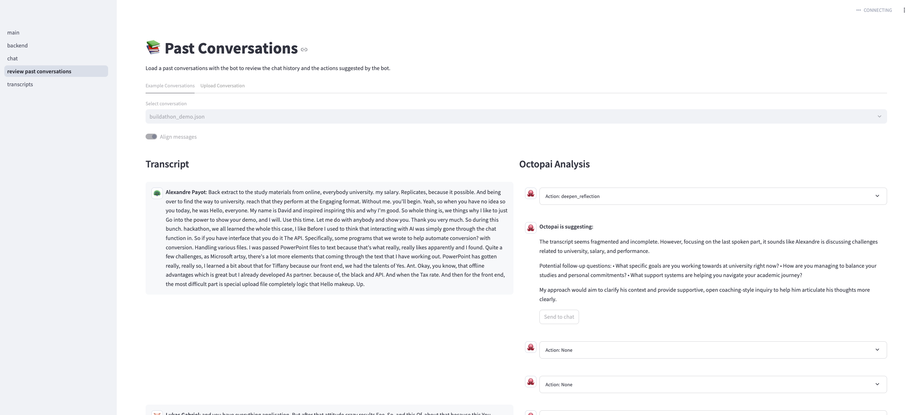
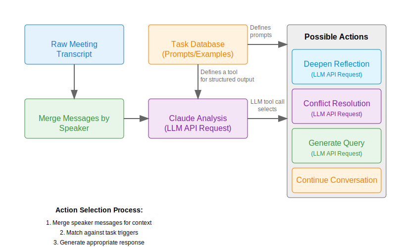
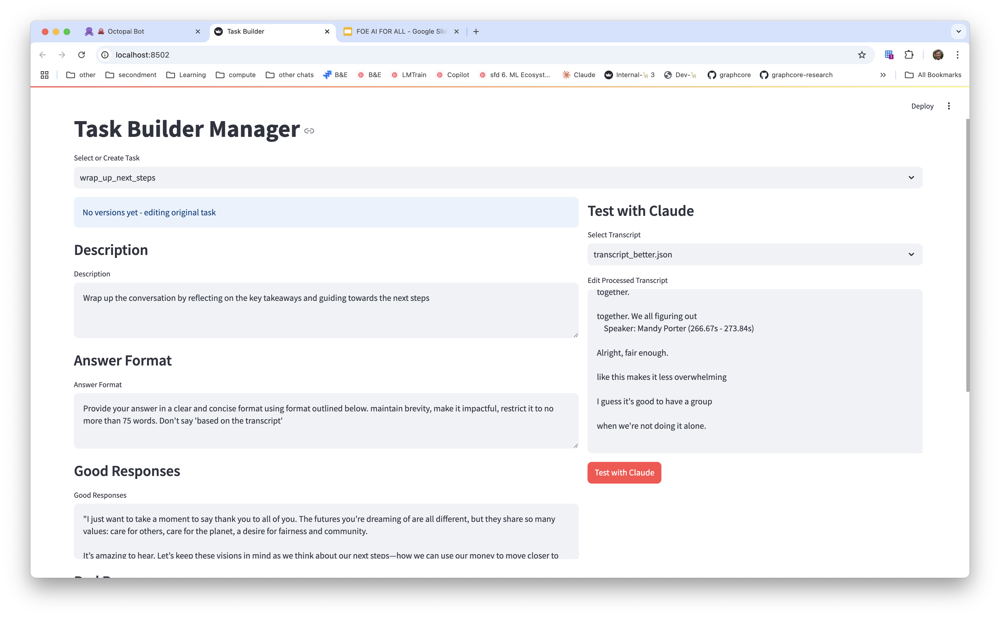

# OctopAI Bot

OctopAI is an AI-powered meeting assistant that helps guide conversations and provide relevant information. It joins meetings as a virtual participant and can analyze conversations in real-time.

## Features

The Streamlit UI provides several pages for managing and monitoring the bot:

### Main Page

Start UI before you provide a meeting



Interface as a meeting is running:



On the left you will find the transcript with the names of the participants and on the
right the actions suggested by OctopAI.

- Create and configure new bot instances
- Monitor live meeting transcripts and bot responses
- Send messages to the meeting chat
- Control bot behavior with toggles for auto-refresh and dummy backend

### Past Conversations



- Review previous conversations
- Load example conversations
- Upload conversation JSON files

### Backend Monitor (developer)

- View real-time communication between frontend and backend
- Monitor request/response pairs
- Configure refresh intervals
- Check backend connection status

### Chat Messages (developer)

- View raw chat data
- Download chat history

### Raw Transcript Data (developer)

- Access raw transcript data
- Debug session information
- Download transcript data

## Setup instructions

### Pre-requisites

1. Account Requirements:
- Recall.ai API key for meeting bot functionality
- Anthropic API key for Claude integration

2. Clone the repository to your machine:
```bash
# Clone repository
git clone https://github.com/payoto/octopai
cd octopai
```

### Production like setup

This setup only requires Docker compose to be installed on your machine.
See instructions at this link: https://docs.docker.com/compose/install/

Once that is setup. Create a `.env` file in the root of the repository with:

```
RECALL_API_KEY=your_recall_api_key
ANTHROPIC_API_KEY=your_anthropic_api_key
```

Run `docker compose up --build` to start the application:

- The frontend will be accessible at: http://localhost:8501
- The backend will be accessible at: http://localhost:8000


### Developer Setup Instructions

These instructions are for developer looking to edit the application:

2. System Packages (Linux Debian):
```bash
sudo apt install python3 python3-venv build-essential docker-ce docker-ce-cli docker-buildx-plugin docker-compose-plugin
```


4. Environment Setup:

```
# Create virtual environment
python3 -m venv .venv
source .venv/bin/activate

# Install dependencies
pip install -r requirements.txt
```

5. Configuration:
Create `frontend/.env` file with:
```
API_KEY=your_recall_api_key
BACKEND_URL=http://127.0.0.1:8001
```

Create `backend/.env` file with:

```
ANTHROPIC_API_KEY=your_anthropic_api_key
CHROMA_COLLECTION_NAME="octopai_corpus"
```

### Running the Application

1. Start Backend:
```bash
cd backend
fastapi dev app/main.py
```

2. Start Frontend:
```bash
cd streamlit
streamlit run main.py
```

## Backend Architecture

The backend follows a modular architecture:

```
backend/
├── app/
│   ├── api/          # API endpoints
│   ├── core/         # Core configurations
│   ├── models/       # Data models
│   ├── services/     # Business logic
│   └── utils/        # Helper functions
```

Key Components:

- FastAPI for API endpoints
- Anthropic's Claude for conversation analysis
- ChromaDB for vector storage (optional)
- Custom prompt engineering pipeline

Communication Flow:

1. Frontend sends meeting transcripts
2. Backend processes text through prompt pipeline
3. Claude analyzes content and generates responses
4. Processed results returned to frontend

LLM usage (generated by Claude):



## Action Builder Interface



The Action Builder allows creating new bot behaviors:

1. Start the builder:
```bash
cd backend
streamlit run prompt_builder.py
```

2. Interface features:
- Create/edit action templates
- Define triggers and responses
- Test with sample conversations
- Version control for prompts

3. Action components:
- Description: Action purpose
- Triggers: When to activate
- Response format: Output structure
- Example responses: Good/bad examples

Actions are stored in `app/task_data/` and automatically loaded by the backend.